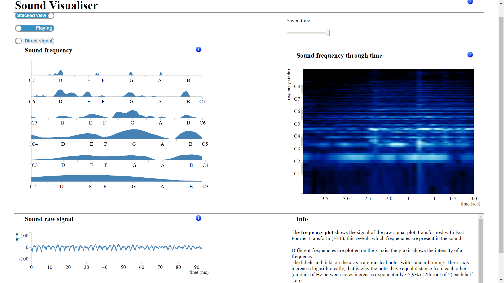
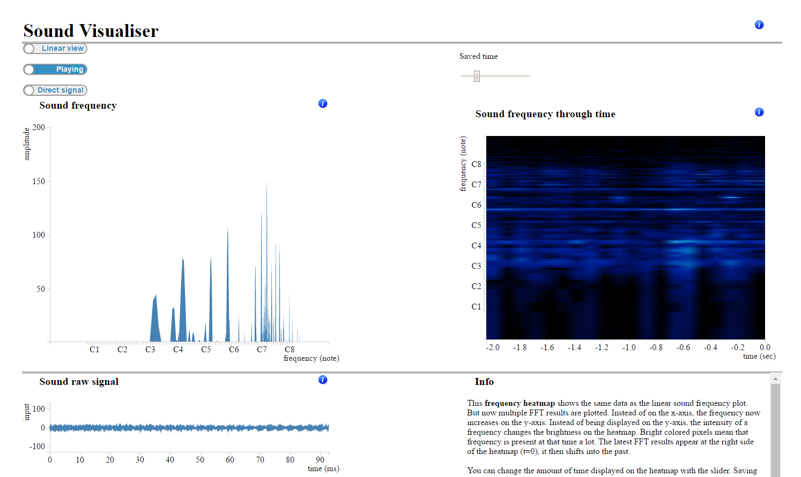

# Sound Visualiser

>Permission is hereby granted, free of charge, to any person obtaining a copy
>of this software and associated documentation files (the "Sound Visualiser"), to deal
>in the Software without restriction, including without limitation the rights
>to use, copy, modify, merge, publish, distribute, sublicense, and/or sell
>copies of the Software, and to permit persons to whom the Software is
>furnished to do so, subject to the following conditions:
>
>The above copyright notice and this permission notice shall be included in all
>copies or substantial portions of the Software.
>
>THE SOFTWARE IS PROVIDED "AS IS", WITHOUT WARRANTY OF ANY KIND, EXPRESS OR
>IMPLIED, INCLUDING BUT NOT LIMITED TO THE WARRANTIES OF MERCHANTABILITY,
>FITNESS FOR A PARTICULAR PURPOSE AND NONINFRINGEMENT. IN NO EVENT SHALL THE
>AUTHORS OR COPYRIGHT HOLDERS BE LIABLE FOR ANY CLAIM, DAMAGES OR OTHER
>LIABILITY, WHETHER IN AN ACTION OF CONTRACT, TORT OR OTHERWISE, ARISING FROM,
>OUT OF OR IN CONNECTION WITH THE SOFTWARE OR THE USE OR OTHER DEALINGS IN THE
>SOFTWARE.

> Name: Leander de Kraker 
> Stnr: 10423354 
> Date: 2017-2-2 

#### Description

The program uses the user's microphone to visualise the sound signal of the microphone. 
It also applies a Fast Fourier Transformation (FFT), this shows the user which sound frequencies are present in the sound. 
Frequency in Hz is be replaced by note names of musical instruments: A - G. This enables the user to see what notes are being played in music easily.

#### Questions the program can answer for the user.
- How high can I sing?
- How low can I sing?
- Can I sing what I hear?
- Which notes are being played (and when) in the music that I hear?
- What is the difference in sound spectrum when comparing, guitar, flute, piano and cello for example?

#### Similar applications
Real Time Spectro program written by Norm Spier: [nasmusicsoft](http://nasmusicsoft.com/Spectratune.php "Norm Spier's site"). 
RealTimeSpectro also accesses the microphone and implements a row and spiral visualisation for the sound frequency plots. However, his program calculates the frequency power with a spring system simulation, not an FFT.

Another program by Norm Spier, [SpectraTunePlus](http://nasmusicsoft.com/Spectratune.php "SpectraTunePlus info"). is able to load sound files and shows a frequency spectrum history. [SpectraTunePlus](http://nasmusicsoft.com/Spectratune.php "SpectraTunePlus info") has a more intimidating user interface.
Norm Spier has written a lot of helpful theoretical, practical and nice-to-know information on his website.

[Sonic visualiser](http://sonicvisualiser.org/ "another sound visualizer program") is another program which is a bit similar to my project's program. This program can only handly complete audio files.

